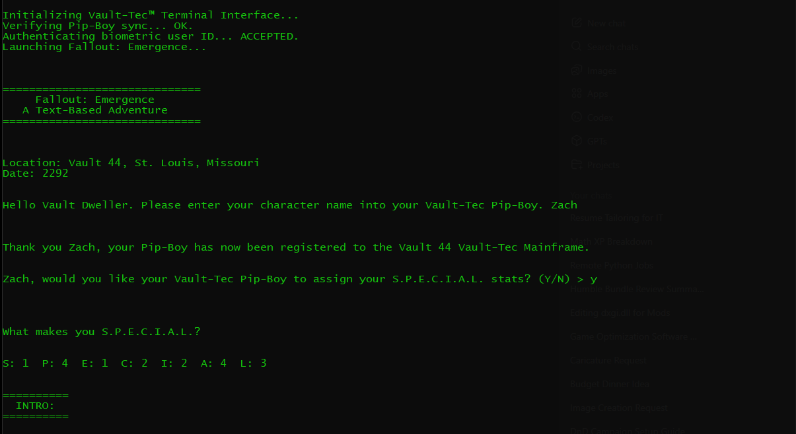

# Fallout: Emergence

Fallout: Emergence is a terminal-based interactive adventure game built in Python.  
The player navigates branching story decisions, skill checks, and multiple endings based on S.P.E.C.I.A.L. stats.

This project demonstrates structured application design, modular functions, input validation, and state-driven logic.

---

## Screenshot

!

  

---

## Features

- Branching narrative decisions
- Skill-based outcomes (S.P.E.C.I.A.L. system)
- Multiple possible endings
- Safe input validation
- Modular function-based structure
- Retro terminal aesthetic

---

## Technologies Used

- Python 3
- Command Line Interface (CLI)
- Randomized stat generation
- Structured control flow

---

## Project Structure

    fallout-emergence-terminal/
    ├── main.py
    ├── README.md
    └── .gitignore

---

## What I Learned

- Structuring applications using functions
- Managing application state with dictionaries
- Implementing safe user input validation
- Writing maintainable, modular Python code
- Designing branching logic systems
- Refactoring procedural scripts into organized architecture

---

## How to Run

1. Make sure Python 3 is installed.

2. Clone the repository:

